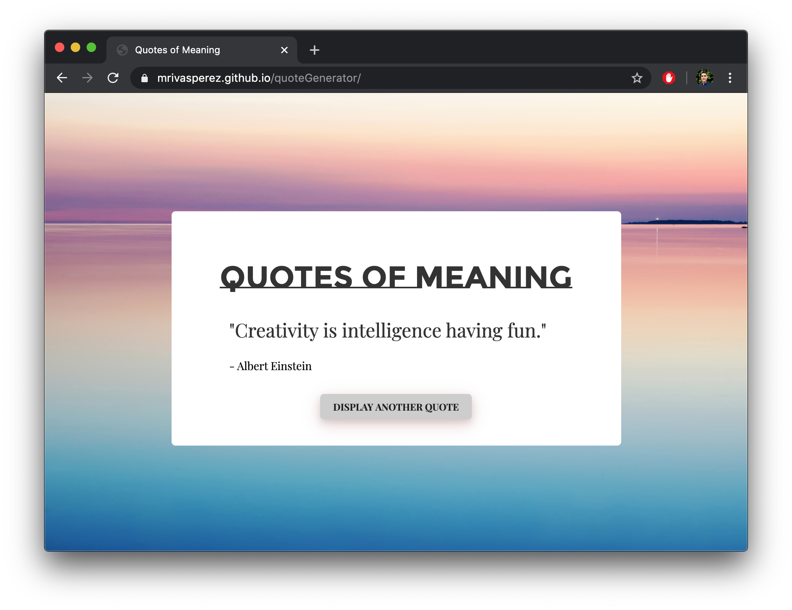

# quoteGenerator: A generator for meaningful quotes.
by mrivasperez - live demo: <https://mrivasperez.github.io/quoteGenerator/>

## About

This quote generator generates a meaninful quote when the user loads the page and generates a new one when the user requests another quote by pressing the button. I created this project to improve my CSS and JS skills when I just getting started with web development.

## Screenshots

> A screenshot of quote generator displaying my favorite quote from Albert Einstein.
